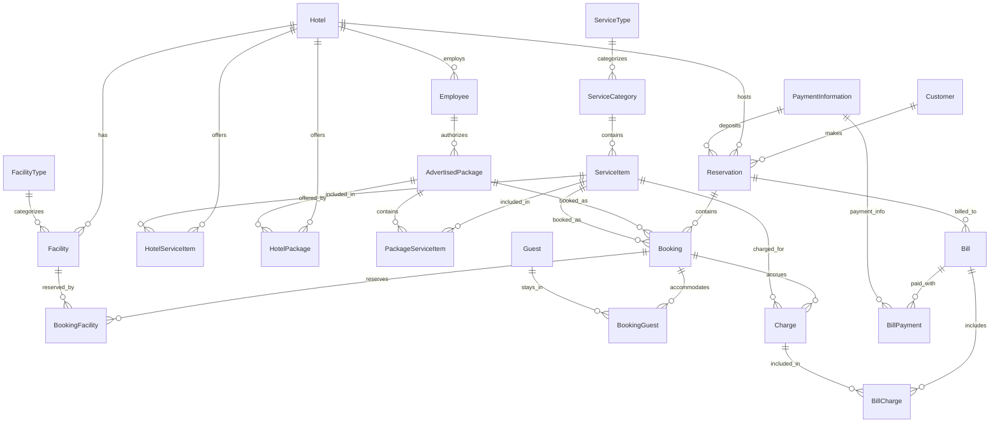

# LeisureConnect - Hotel Management System

## Project Overview

LeisureConnect is a centralized hotel management system designed for LeisureAustralasia group, which operates hotels and resorts throughout Australia (Brisbane, Cairns, Newcastle, Broome, and Darwin) and Asia (Vietnam, Singapore, Thailand, Sri Lanka, and India). The system provides a web-enabled central IT solution for hotel bookings, reservations, and billing.

This project was developed as part of COMP3350 - Advanced Database Assignment 1, focusing on database design and implementation with a web interface for hotel staff to make phone reservations.

## Features

- Centralized management of multiple hotels and resorts
- Facility and service management
- Package creation and management
- Reservation booking system with capacity management
- Guest management
- Billing and payment processing
- Web interface for staff to make phone reservations

## Database Design

The database is designed to handle all aspects of hotel management including:
- Hotels and facilities
- Service items and packages
- Customers and guests
- Reservations and bookings
- Billing and payments

### Database Schema



## Database Dictionary

### Core Entities

| Entity | Description |
|--------|-------------|
| Hotel | Represents hotels and resorts in the LeisureAustralasia group |
| Facility | Represents facilities within hotels (rooms, conference venues, pools, gyms, etc.) |
| FacilityType | Categorizes facilities (standard room, family room, conference hall, etc.) |
| ServiceItem | Represents services offered by hotels (accommodation, meals, etc.) |
| ServiceCategory | Categorizes services (food, accommodation, events, etc.) |
| ServiceType | High-level categorization of service categories |
| AdvertisedPackage | Packages of services offered to guests (e.g., half-board package) |
| Customer | Individuals who make reservations |
| Guest | Individuals who stay at the hotels |
| Reservation | Booking record for a customer (may include multiple bookings) |
| Booking | Individual service or package bookings within a reservation |
| Bill | Final invoice for a reservation |
| Charge | Individual charges accrued during a stay |
| PaymentInformation | Payment details for deposits and final payments |

### Key Relationships

| Relationship | Description |
|--------------|-------------|
| HotelServiceItem | Links hotels with the services they offer |
| HotelPackage | Links hotels with the packages they offer |
| PackageServiceItem | Links packages with their included services |
| BookingFacility | Links bookings with the facilities reserved |
| BookingGuest | Links bookings with the guests staying |
| BillCharge | Links bills with their individual charges |
| BillPayment | Links bills with their payment records |

## Project Setup and Installation

### Prerequisites

- Docker and Docker Compose
- Git

### Setup Steps

1. Clone the repository
   ```bash
   git clone https://github.com/your-username/leisureconnect.git
   cd leisureconnect
   ```

2. Create two environment files in the root directory:

   a. `docker.dev.env` file for Docker configuration:
   ```
   # Database Configuration
   SA_PASSWORD=P4ssw0rd!
   ACCEPT_EULA=Y
   
   # API Configuration
   ConnectionStrings__Default=Server=leisureconnect-db;Database=LeisureAustralasiaDB;User Id=sa;Password=P4ssw0rd!;TrustServerCertificate=True;
   ```
   
   b. `dev.env` file for local development:
   ```
   LEISURE_AUSTRALASIA_DB_CONNECTION_STRING=Server=localhost,1434;Database=LeisureAustralasiaDB;TrustServerCertificate=True;User Id=sa;Password=P4ssw0rd!;
   SA_PASSWORD=P4ssw0rd!
   ACCEPT_EULA=true
   ```

3. Build and start the containers
   ```bash
   docker-compose -f "docker-compose.dev.yml" up
   ```
   
   Note: Ensure both environment files are properly configured before starting the containers. The `docker.dev.env` file is used by the Docker services, while the `dev.env` file can be used for local development outside of Docker.

4. Wait for all services to start up. This may take a few minutes as the database needs to be initialized and the application needs to be built.

### Running the Application

Once all services are up and running:

1. Access the web application at http://localhost:4200
2. The API is available at http://localhost:5116
3. The database is available at localhost:1434 (SQL Server)
   - Username: sa
   - Password: YourSecurePassword123! (or whatever you set in docker.dev.env)

## Usage

### Making a Phone Reservation

1. Log in to the web application
2. Navigate to "Phone Reservation" in the menu
3. Fill in the customer information
4. Select a hotel and date range
5. Browse and select available packages
6. Add guest information
7. Enter payment details
8. Submit the reservation

## Implementation Details

### Backend

- ASP.NET Core Web API
- Entity Framework Core for ORM
- SQL Server database
- T-SQL stored procedures for key business logic

### Frontend

- Angular 19
- Tailwind CSS for styling
- Reactive forms for data binding
- HTTP client for API communication

### Database

- Microsoft SQL Server
- Implemented with T-SQL scripts
- Normalized schema design
- Stored procedures for package creation and reservation booking

## Stored Procedures

### usp_createPackage

Creates a new service package with specified services, pricing, and availability period.

Parameters:
- Package name
- Service item list (table-valued parameter)
- Description
- Valid period start/end dates
- Advertised price and currency
- Authorizing employee

### usp_makeReservation

Creates a new reservation with bookings, ensuring capacity constraints are met.

Parameters:
- Customer details
- List of services/packages
- Guest list
- Hotel ID
- Payment information

## Project Structure

```
leisureconnect/
├── database/              # Database scripts and initialization
├── docker/                # Docker configuration files
├── src/                   # Source code
│   ├── LeisureConnect.API/       # Backend API
│   ├── LeisureConnect.Core/      # Core business logic
│   ├── LeisureConnect.Data/      # Data access layer
│   └── LeisureConnect.Client/    # Angular frontend
├── docker-compose.yml     # Docker Compose configuration
└── docker.dev.env         # Environment variables
```

## License

This project is created for educational purposes as part of COMP3350 - Advanced Database course.