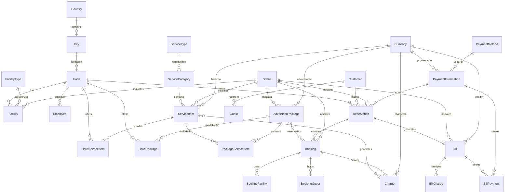

# LeisureConnect - Hotel Management System

LeisureConnect is a comprehensive hotel management system for the LeisureAustralasia group, designed to centralize bookings, reservations, and billing across their hotels and resorts throughout Australia and Asia.

## Project Overview

This project provides a complete solution for hotel chain management with the following features:

- Centralized hotel and resort management
- Facility and service tracking
- Package and promotion creation
- Customer reservation system
- Room booking and allocation
- Guest management
- Billing and payment processing

## System Architecture

The system consists of the following components:

- **Database**: Microsoft SQL Server database for storing all application data
- **API**: ASP.NET Core REST API for business logic and data access
- **Client**: Angular 19 frontend application for user interface
- **Docker**: Containerization for easy deployment and development

## Prerequisites

Before setting up the project, ensure you have the following installed:

- [Docker](https://www.docker.com/products/docker-desktop/) (version 20.10.0 or later)
- [Docker Compose](https://docs.docker.com/compose/install/) (version 2.0.0 or later)
- [Git](https://git-scm.com/downloads) (for cloning the repository)

## Setup Instructions

### 1. Clone the Repository

```bash
git clone https://github.com/your-organization/leisureconnect.git
cd leisureconnect
```

### 2. Configure Environment Variables

Create a `docker.dev.env` file in the project root with the following variables:

```
# Database Configuration
SA_PASSWORD=P4ssw0rd!
DATABASE_NAME=LeisureAustralasiaDB

# Client Configuration
NODE_ENV=development
API_URL=http://localhost:5116
```

### 3. Build and Start the Containers

```bash
docker-compose up -d
```

This command will:
- Build the database container and initialize it
- Build and start the API
- Build and start the Angular frontend application

## Running the Project

Once the containers are up and running, you can access:

- Frontend application: [http://localhost:4200](http://localhost:4200)
- API: [http://localhost:5116](http://localhost:5116)
- SQL Server: localhost:1434 (use SQL Server Management Studio or another client)

### User Credentials

The following default user credentials are created during initial setup:

#### Administrator
- Email: admin@leisureconnect.com
- Password: Admin123!

#### Front Desk Staff
- Email: frontdesk@leisureconnect.com  
- Password: Staff123!

## Database Schema



## Database Dictionary

### Reference Tables

| Table | Description |
|-------|-------------|
| Status | Tracks status of various entities (Active, Inactive, Reserved, etc.) |
| Currency | Currencies used throughout the system |
| Country | Countries where hotels are located |
| City | Cities where hotels are located |
| Role | Employee roles and permissions |
| Department | Hotel departments |
| FacilityType | Types of facilities (room, pool, gym, etc.) |
| ServiceType | Types of services offered |
| ServiceCategory | Categories of services under each type |
| PaymentMethod | Payment methods accepted |

### Core Entities

#### Hotel
| Field | Type | Description |
|-------|------|-------------|
| HotelId | INT | Primary key |
| Name | NVARCHAR(100) | Hotel name |
| Address | NVARCHAR(255) | Physical address |
| CityId | INT | Reference to City |
| PhoneNumber | NVARCHAR(20) | Contact phone |
| Description | NVARCHAR(500) | Hotel description |
| TotalCapacity | INT | Maximum guest capacity |
| BaseCurrencyId | INT | Default currency |
| IsActive | BIT | Whether hotel is active |

#### Facility
| Field | Type | Description |
|-------|------|-------------|
| FacilityId | INT | Primary key |
| Name | NVARCHAR(100) | Facility name |
| FacilityTypeId | INT | Type of facility |
| HotelId | INT | Hotel the facility belongs to |
| Description | NVARCHAR(500) | Facility description |
| Capacity | INT | Maximum people capacity |
| StatusId | INT | Current facility status |

#### ServiceItem
| Field | Type | Description |
|-------|------|-------------|
| ServiceItemId | INT | Primary key |
| Name | NVARCHAR(100) | Service name |
| ServiceCategoryId | INT | Category of service |
| FacilityTypeId | INT | Required facility type (if any) |
| BaseCost | DECIMAL(10,2) | Cost to hotel |
| BaseCurrencyId | INT | Currency for base cost |
| Capacity | INT | Maximum capacity if applicable |
| AvailableTimes | NVARCHAR(255) | When service is available |
| Restrictions | NVARCHAR(500) | Any limitations |

#### AdvertisedPackage
| Field | Type | Description |
|-------|------|-------------|
| PackageId | INT | Primary key |
| Name | NVARCHAR(100) | Package name |
| Description | NVARCHAR(500) | Package description |
| StartDate | DATE | Availability start date |
| EndDate | DATE | Availability end date |
| AdvertisedPrice | DECIMAL(10,2) | Published price |
| AdvertisedCurrencyId | INT | Currency for price |
| GracePeriodDays | INT | Cancellation grace period |
| IsStandardPackage | BIT | Whether standard or custom |

#### Customer
| Field | Type | Description |
|-------|------|-------------|
| CustomerId | INT | Primary key |
| FirstName | NVARCHAR(50) | First name |
| LastName | NVARCHAR(50) | Last name |
| Email | NVARCHAR(100) | Email address |
| PhoneNumber | NVARCHAR(20) | Contact phone |
| Address | NVARCHAR(255) | Physical address |
| LoyaltyPoints | INT | Accumulated points |

#### Reservation
| Field | Type | Description |
|-------|------|-------------|
| ReservationId | INT | Primary key |
| ReservationNumber | NVARCHAR(20) | Unique identifier |
| CustomerId | INT | Customer making reservation |
| HotelId | INT | Hotel being reserved |
| ReservationDate | DATETIME2 | When reservation was made |
| TotalAmount | DECIMAL(10,2) | Total cost |
| DepositAmount | DECIMAL(10,2) | Required deposit |
| StatusId | INT | Current status |

#### Booking
| Field | Type | Description |
|-------|------|-------------|
| BookingId | INT | Primary key |
| ReservationId | INT | Parent reservation |
| PackageId | INT | Reserved package (if applicable) |
| ServiceItemId | INT | Reserved service (if applicable) |
| StartDate | DATE | Check-in date |
| EndDate | DATE | Check-out date |
| Quantity | INT | Number of items/rooms |
| StatusId | INT | Current status |

#### Bill
| Field | Type | Description |
|-------|------|-------------|
| BillId | INT | Primary key |
| ReservationId | INT | Associated reservation |
| TotalAmount | DECIMAL(10,2) | Total amount due |
| DepositAmount | DECIMAL(10,2) | Deposit received |
| DiscountAmount | DECIMAL(10,2) | Any discounts applied |
| PaidAmount | DECIMAL(10,2) | Amount already paid |
| StatusId | INT | Payment status |

## Development

### Frontend Development

The frontend application is built with Angular 19 and is located in the `src/LeisureConnect.Client` directory. The application uses:

- Angular 19 with signals for state management
- Reactive forms for user input
- Tailwind CSS for styling

To make changes to the frontend:

1. The application is mounted as a volume, so changes to source files will be reflected in real-time
2. Navigate to http://localhost:4200 to view the application
3. Changes to the code will automatically trigger a rebuild and reload

### Backend Development

The backend API is built with ASP.NET Core and is located in the `src` directory. To make changes:

1. Edit the files in the `src` directory
2. Rebuild the API container with `docker-compose up -d --build api`

### Database Development

To make changes to the database schema:

1. Modify the SQL scripts in the `database` directory
2. Rebuild the database container with `docker-compose up -d --build database-init`

## Troubleshooting

### Database Connection Issues

If the API cannot connect to the database:

1. Check if the database container is running: `docker ps`
2. Verify the database initialization was successful: `docker logs leisureconnect-db-init`
3. Check the connection string in the `docker.dev.env` file

### Frontend Not Loading

If the frontend application doesn't load:

1. Check if the app container is running: `docker ps`
2. View the container logs: `docker logs leisureconnect-app`
3. Make sure the API URL is correctly set in the environment

### General Issues

For general troubleshooting:

1. Stop all containers: `docker-compose down`
2. Rebuild and restart: `docker-compose up -d --build`
3. Check logs for all containers: `docker-compose logs`

## License

© 2025 LeisureAustralasia Group. All rights reserved.